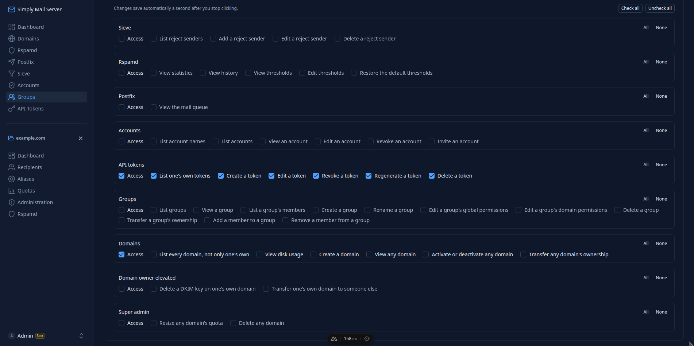
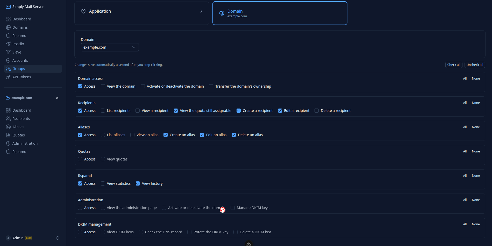

# @naskot/custom-permission-guard

Framework-agnostic ACL core: group-based access control for **global** and **per-domain**
resources, throw-on-forbidden semantics, zero coupling to any framework or database.

## What is this package?

A permission engine you configure, not a framework you adopt. It never opens an HTTP route,
never touches a database, and never reads `process.env`, the consumer wires all three. Two
independent resource tiers (`global`, `domain`), each with its own `access`-gated
read/create/modify/delete rules; group-based membership with OR/union semantics across
multiple groups; domain ownership and global→domain "bridge" bypasses; a `dependsOn` gate for
cross-resource prerequisites, available at both tiers; and full group entity management (CRUD, membership, default
group, permission grants) with a built-in anti-lockout invariant.

## Granular ACL, handled for you

You declare your resources and the actions each one allows. The library does the rest: it
resolves a caller's effective permissions across every group they belong to (a union, never an
intersection), enforces `access` as the prerequisite of every other action, walks `dependsOn`
prerequisites recursively, applies the domain-ownership and global→domain bridge bypasses, and
refuses any write that would lock the last administrator out. Your code makes a single call,
`assertOne` or `assertAll`, and it either returns or throws. No `if (role === "admin")`
sprinkled through your controllers, no authorization logic duplicated per route.

**Granular means granular.** Actions are not a fixed `read`/`write` set you have to bend your
domain into. Every capability you can name becomes a first-class permission (`rotate-dkim-key`,
`reset-rspamd-thresholds`, `invite-account`, `transfer-domain-ownership`), as many as your
product has, on as many resources as you need, across two independent tiers (`global` and
per-`domain`). The engine treats an arbitrary action string exactly like any other: there is no
built-in vocabulary to fight, and adding a permission is a one-line change to a config array,
never a migration of the engine itself.

**Nothing of yours leaves your hands.** It opens no socket, touches no database, and reads no
`process.env`, with zero runtime dependencies. Every lookup is SQL you own and pass in, so a
check is a handful of indexed reads plus pure in-memory set logic, and you keep full control of
caching, pooling and query shape, and the authorization layer adds no I/O of its own.

The two grids below come from a real product built on this engine, one screenshot per tier. Each
resource exposes its own named actions, and every action is gated behind `access`.

### Global tier



### Per-domain tier



## Install

```bash
npm i @naskot/custom-permission-guard
```

## Quick start

Every config field, shown at once, nothing hidden behind "see the docs for the rest":

```ts
import mysql from "mysql2/promise";
import { createCustomPermissionGuard } from "@naskot/custom-permission-guard";
import { createSqlData } from "./sql-data.js"; // full source below, raw SQL via mysql2, no ORM

const pool = mysql.createPool({
  host: process.env.DB_HOST,
  port: Number(process.env.DB_PORT ?? 3306),
  user: process.env.DB_USER,
  password: process.env.DB_PASSWORD,
  database: process.env.DB_NAME,
});

const customPermissionGuard = createCustomPermissionGuard({
  onForbidden: (reason) => {
    throw new Error(reason);
  },
  // "single": your own schema enforces 1 group per account (e.g. a
  // UNIQUE(account_id) constraint on your membership table), the library
  // adds no extra logic for either mode, it just documents the invariant.
  groupMode: "multiple",
  // Enforcement kill-switch, checked BEFORE schemas: disable a tier+dimension
  // here and any assertOne/assertAll call for it throws
  // CustomPermissionGuardConfigError immediately, no matter what schemas says.
  authorizedPermissions: {
    global: { acrud: true, custom: true },
    domain: { acrud: true, custom: true },
  },
  // Anti-lockout: setGroupGlobalPermissions/deleteGroup refuse any write that
  // would leave zero groups system-wide holding ALL of these actions at once.
  lockoutProtected: [{ resource: "groups", actions: ["access", "modify"] }],
  schemas: {
    global: {
      groups: { rules: ["access", "read", "create", "modify", "delete"] },
      // "projects" is an invented, generic example resource, swap in
      // whatever your own app actually manages.
      projects: {
        rules: ["access", "read", "create", "modify", "delete"],
        custom: { "2fa": (accountId) => hasTwoFactorEnabled(accountId) }, // your own lookup
      },
      // dependsOn works at the global tier too: "billing" is never granted
      // without projects:access first, checked recursively, same as the
      // domain tier's tasks/workspace pair below.
      billing: {
        rules: ["access", "read"],
        dependsOn: [{ resource: "projects", action: "access" }],
      },
    },
    domain: {
      // bridgeFromGlobal: holding projects.<action> globally also grants
      // "workspace" on ANY domainId, without a dedicated per-domain row.
      workspace: { rules: ["access", "read", "create", "modify", "delete"], bridgeFromGlobal: "projects" },
      // dependsOn: "tasks" is never granted on a project without
      // workspace:access on that SAME project first, checked recursively,
      // so it also benefits from workspace's own ownership/bridge bypasses.
      tasks: {
        rules: ["access", "read", "create", "modify", "delete"],
        dependsOn: [{ resource: "workspace", action: "access" }],
      },
    },
  },
  // Every callback is raw SQL you own, the library never touches a
  // database itself. Full source of createSqlData is below.
  data: createSqlData(pool),
});

await customPermissionGuard.assertOne.global(accountId, "projects", { acrud: ["create"] });
```

`createSqlData`, the library's entire `data` contract implemented as plain
[`mysql2`](https://github.com/sidorares/node-mysql2) queries, no ORM, against the reference schema in
[`__PLAN/expected-custom-permission-guard/tables.sql`](../__PLAN/expected-custom-permission-guard/tables.sql):

```ts
import type { Pool, ResultSetHeader, RowDataPacket } from "mysql2/promise";

interface GroupRow extends RowDataPacket {
  id: number;
  name: string;
  description: string | null;
  owner_id: string | null;
  is_default: number;
  created_at: Date;
}

interface CountRow extends RowDataPacket {
  memberCount: number;
}

export function createSqlData(pool: Pool) {
  return {
    async findAccountGroupIds(accountId: string) {
      const [rows] = await pool.query<RowDataPacket[]>("SELECT group_id AS groupId FROM account_groups WHERE account_id = ?", [
        accountId,
      ]);
      return rows.map((r) => r.groupId as number);
    },
    async findGlobalPermissions(groupId: number) {
      const [rows] = await pool.query<RowDataPacket[]>(
        "SELECT resource, action FROM group_global_permissions WHERE group_id = ?",
        [groupId]
      );
      return rows.map((r) => ({ resource: r.resource as string, action: r.action as string }));
    },
    async findDomainPermissions(groupId: number) {
      const [rows] = await pool.query<RowDataPacket[]>(
        "SELECT domain_id AS domainId, resource, action FROM group_domain_permissions WHERE group_id = ?",
        [groupId]
      );
      return rows.map((r) => ({
        domainId: r.domainId as number,
        resource: r.resource as string,
        action: r.action as string,
      }));
    },
    async findOwnedDomainIds(accountId: string) {
      const [rows] = await pool.query<RowDataPacket[]>("SELECT id FROM domains WHERE owner_id = ?", [accountId]);
      return rows.map((r) => r.id as number);
    },

    async createGroup(name: string) {
      const [result] = await pool.query<ResultSetHeader>("INSERT INTO `groups` (name) VALUES (?)", [name]);
      return result.insertId;
    },
    async listGroups() {
      const [rows] = await pool.query<GroupRow[]>("SELECT id, name, description, owner_id, is_default, created_at FROM `groups`");
      const groups = [];
      for (const g of rows) {
        const [[count]] = await pool.query<CountRow[]>("SELECT COUNT(*) AS memberCount FROM account_groups WHERE group_id = ?", [
          g.id,
        ]);
        groups.push({
          id: g.id,
          name: g.name,
          description: g.description,
          ownerId: g.owner_id,
          isDefault: Boolean(g.is_default),
          memberCount: count.memberCount,
          createdAt: g.created_at,
        });
      }
      return groups;
    },
    async findGroup(groupId: number) {
      const [rows] = await pool.query<GroupRow[]>(
        "SELECT id, name, description, owner_id, is_default, created_at FROM `groups` WHERE id = ?",
        [groupId]
      );
      const g = rows[0];
      if (!g) return null;
      return {
        id: g.id,
        name: g.name,
        description: g.description,
        ownerId: g.owner_id,
        isDefault: Boolean(g.is_default),
        createdAt: g.created_at,
      };
    },
    async updateGroup(groupId: number, changes: { name?: string; description?: string }) {
      if (changes.name !== undefined) {
        await pool.query("UPDATE `groups` SET name = ? WHERE id = ?", [changes.name, groupId]);
      }
      if (changes.description !== undefined) {
        await pool.query("UPDATE `groups` SET description = ? WHERE id = ?", [changes.description, groupId]);
      }
    },
    async setGroupOwner(groupId: number, accountId: string | null) {
      await pool.query("UPDATE `groups` SET owner_id = ? WHERE id = ?", [accountId, groupId]);
    },
    async deleteGroup(groupId: number) {
      await pool.query("DELETE FROM `groups` WHERE id = ?", [groupId]);
    },

    async setGroupGlobalPermissions(groupId: number, permissions: { resource: string; action: string }[]) {
      const connection = await pool.getConnection();
      try {
        await connection.beginTransaction();
        await connection.query("DELETE FROM group_global_permissions WHERE group_id = ?", [groupId]);
        for (const { resource, action } of permissions) {
          await connection.query("INSERT INTO group_global_permissions (group_id, resource, action) VALUES (?, ?, ?)", [
            groupId,
            resource,
            action,
          ]);
        }
        await connection.commit();
      } catch (err) {
        await connection.rollback();
        throw err;
      } finally {
        connection.release();
      }
    },
    async setGroupDomainPermissions(groupId: number, permissions: { domainId: number; resource: string; action: string }[]) {
      const connection = await pool.getConnection();
      try {
        await connection.beginTransaction();
        await connection.query("DELETE FROM group_domain_permissions WHERE group_id = ?", [groupId]);
        for (const { domainId, resource, action } of permissions) {
          await connection.query(
            "INSERT INTO group_domain_permissions (group_id, domain_id, resource, action) VALUES (?, ?, ?, ?)",
            [groupId, domainId, resource, action]
          );
        }
        await connection.commit();
      } catch (err) {
        await connection.rollback();
        throw err;
      } finally {
        connection.release();
      }
    },
    async countGroupsWithGlobalPermission(resource: string, actions: string[]) {
      const [rows] = await pool.query<RowDataPacket[]>(
        `SELECT group_id FROM group_global_permissions WHERE resource = ? AND action IN (?)
         GROUP BY group_id HAVING COUNT(DISTINCT action) = ?`,
        [resource, actions, actions.length]
      );
      return rows.length;
    },

    async assignAccountToGroup(accountId: string, groupId: number) {
      await pool.query("INSERT INTO account_groups (account_id, group_id) VALUES (?, ?)", [accountId, groupId]);
    },
    async findGroupMemberIds(groupId: number) {
      const [rows] = await pool.query<RowDataPacket[]>("SELECT account_id AS accountId FROM account_groups WHERE group_id = ?", [
        groupId,
      ]);
      return rows.map((r) => r.accountId as string);
    },
    async removeAccountFromGroup(accountId: string, groupId: number) {
      await pool.query("DELETE FROM account_groups WHERE account_id = ? AND group_id = ?", [accountId, groupId]);
    },

    async setDefaultGroup(groupId: number | null) {
      const connection = await pool.getConnection();
      try {
        await connection.beginTransaction();
        await connection.query("UPDATE `groups` SET is_default = FALSE WHERE is_default = TRUE");
        if (groupId !== null) {
          await connection.query("UPDATE `groups` SET is_default = TRUE WHERE id = ?", [groupId]);
        }
        await connection.commit();
      } catch (err) {
        await connection.rollback();
        throw err;
      } finally {
        connection.release();
      }
    },
    async findDefaultGroupId() {
      const [rows] = await pool.query<RowDataPacket[]>("SELECT id FROM `groups` WHERE is_default = TRUE LIMIT 1");
      return rows[0] ? (rows[0].id as number) : null;
    },
  };
}
```

## API

- `assertOne.{global,domain}` / `assertAll.{global,domain}.{acrud,custom}`, throw-on-forbidden
  checks; `assertOne` is single-resource sugar over the batch `assertAll` primitives.
- `utils`, an optional helper namespace kept apart from the core surface above (an app that never
  needs them can ignore it):
  - `utils.check.{global,domain}(...)`, the non-throwing boolean sibling of `assertOne`: `true`
    when the account holds `resource.action` (same ownership/bridge/dependsOn evaluation), `false`
    otherwise. A misconfiguration still throws `CustomPermissionGuardConfigError`.
  - `utils.findUnheldPermissions(accountId, { global, domain })`, the anti-escalation primitive:
    returns the subset of the requested permissions the account does NOT hold (both arrays empty
    means it holds them all). Build "you may only grant what you hold yourself" on top of it, the
    lib never decides who may grant, nor who is root (see Notes).
  - `utils.diffPermissions(before, after)`, the companion for a full-replace EDIT: returns the rows
    `{ added, removed }` that the edit changes, per tier. Feed the changed rows to
    `findUnheldPermissions` so anti-escalation applies to the CHANGE only, an untouched permission
    the actor lacks then passes through instead of blocking the whole save. It reports facts, not
    policy: added and removed are separate so you decide whether revoking also requires holding.
- `getEffectivePermissions(accountId)`, read-only, never throws; real granted permissions for
  UI consumption (nav gating, etc).
- Group entity CRUD: `listGroups`, `findGroup`, `createGroup`, `updateGroup`, `deleteGroup`,
  `setGroupOwner`.
- Group permission grants: `findGroupGlobalPermissions`, `findGroupDomainPermissions`,
  `setGroupGlobalPermissions`, `setGroupDomainPermissions` (full replace, with write-time
  access-prerequisite cleanup and anti-lockout on the global tier).
- Membership: `assignAccountToGroup`, `removeAccountFromGroup`, `findGroupMemberIds`.
- Default group: `setDefaultGroup`, `onAccountCreated` (auto-assign connector).
- `CustomPermissionGuardConfigError`, thrown for a misconfigured `resource`/`action`/
  `customName` or a disabled `authorizedPermissions` dimension, always distinct from a real
  `onForbidden` denial.

See [`__PLAN/expected-custom-permission-guard/service.md`](../__PLAN/expected-custom-permission-guard/service.md)
for the full interface and design rationale.

## Integration guides

- [Express](./docs/express.md)
- [NestJS](./docs/nestjs.md)

## Proof of concept

[`poc/`](./poc) ships 4 runnable apps, 2 Express, 2 NestJS, one pair per framework configured
`groupMode: "single"` and the other `"multiple"`, that seed fake accounts/groups/permissions
against a real MariaDB and prove allow/deny behavior end to end, no HTTP routes required. See
[`poc/README.md`](./poc/README.md) to run it and read the results.

## Development

```bash
npm ci
npm run lint
npm run typecheck
npm test               # unit tests only (in-memory fake data)
npm run test:integration  # full flow against a real MariaDB via testcontainers
npm run build
```

## Notes

- Configuration rule: never read `process.env` inside the library, read env values in the
  app's own service/provider layer and pass a plain config object in.
- The library has zero runtime dependencies and never opens a database connection or an HTTP
  route itself; every `data.*` callback is SQL/ORM code the consumer owns.
- Anti-escalation (a caller can only grant permissions it already holds) is a POLICY the consumer
  owns, but the lib hands you the primitive to enforce it: `utils.findUnheldPermissions(granterId, ...)`
  returns what the granter lacks, so you throw, log or strip those rows yourself. What counts as a
  grant, and any root/superuser bypass, stay **out of scope**, decide them around the call, never
  as a library config flag.
